### Y Sort? 🥁
Our game looks 3D, but it is actually 2D. All characters and environmental objects are really sprites.

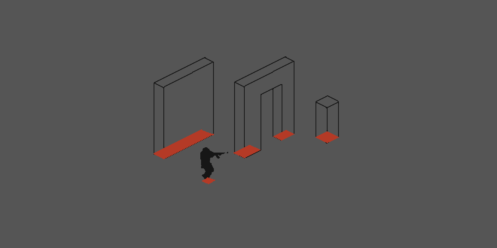

We simulate a 3D world by defining isometric collision shapes (red areas in the image above) in the shape of the “footprint” of the objects. The player character itself also has a footprint. When the footprints collide, the player cannot pass the object.
A two-dimensional world has a coordinate system with a vertical Y axis and a horizontal X axis.
When our objects overlap. It must be determined what is going to be displayed in front and what behind.

### The Basic Setup
We start by defining for each object an origin point. That is the point that is lowest on its Y direction. The origin points are marked in green in the image below.

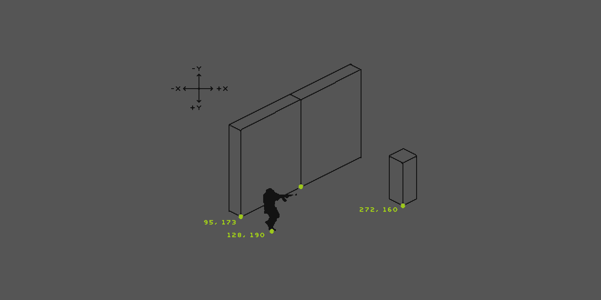

When placing an object in our engine, it automatically receives not only X and Y coordinates, but also a Z order number (sometimes called “Z index”). This third value determines how much “in front”, towards the camera, the object is.
A simple way of handling now which of our overlapping objects is displayed in front and which one behind is to simply sync the objects’ Z order to their vertical Y value.

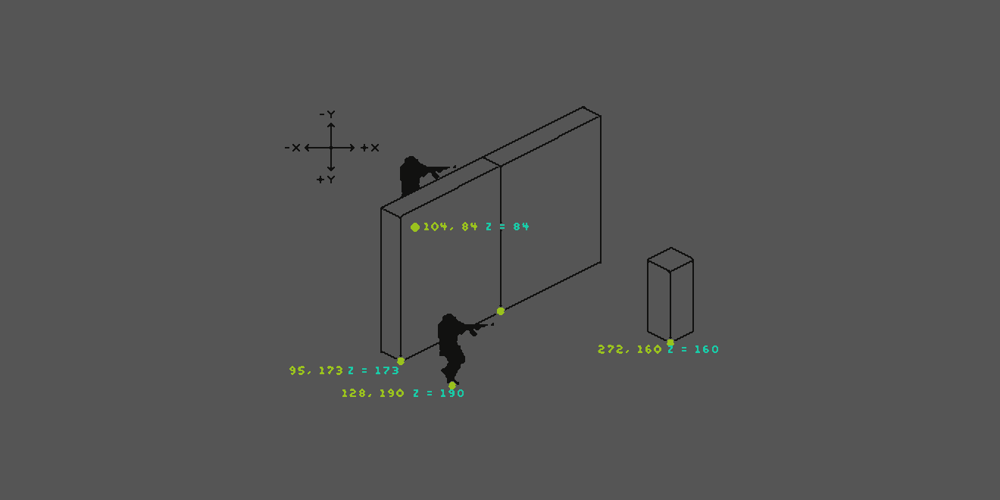

The image above shows each object’s origin point coordinates. The Y value is synced to the Z order. The lower soldier’s Z order value is 190, the wall’s Z order value is 173. The wall’s number is lower, that means the soldier is displayed in front of the wall. The upper soldier is much higher on the map. Its Z order value is 84, thus lower than the wall’s value and he is displayed behind.
This process of syncing Z order to Y values is called “Y sorting”.

### In the isometric World
In a purely 2D game like a typical shoot ‘ em up or jump and run, this method would be all we need. In our isometric game we soon run into problems. Our world is displayed as three dimensional, but in reality - under the hood - it is only two dimensional.

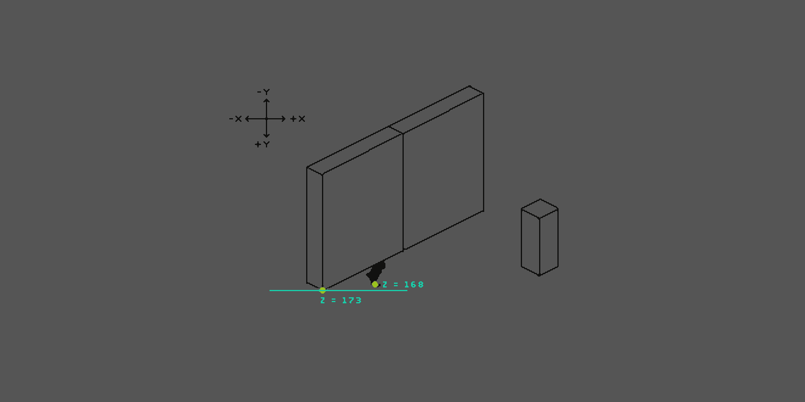

There are cases when a sprite’s Y value becomes smaller than another sprite’s Y value and it is sorted already behind, even though in our isometric world view it should still be displayed in front. In the image above, the player’s origin point, that determines its Z order, is above the origin point of the wall element. The player’s Z order value becomes smaller than the wall’s value. The player is sorted behind the wall. Simply moving up the origin point higher on the player sprite would create similar problems - the player would be displayed on top of objects it should not be.
The problem only occurs with environmental objects of a certain size or “isometric side length”. If the world were divided into a grid, all objects adhere to the grid and the player’s movement is strictly limited to movement on the grid. Each grid segment could have a determined Z order. Think of an isometric chess game, with no animations. In our game, however, the player is supposed to move freely in the world. Object sizes and level design should be more varied, free, and flexible.

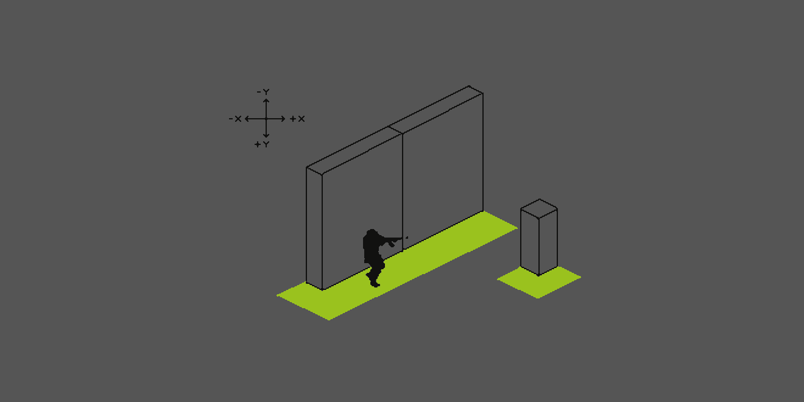

### Solution „Trigger Plate“
Our first approach was to place invisible trigger areas (green in the image above). These areas read out the Z order of the environmental object they are touching and hand that value to the player. The player then adopts the Z order of the environmental object attached to the trigger area and adds +1 so it is displayed in front. The normal Y sorting is disabled while the player is in touch with the trigger area.
The trigger areas could be placed automatically via code. But that would mean all environmental objects would need to stick to a quite rigid grid system. Also, shapes with a more organic footprint are not possible. Alternatively, the override areas would need to be placed by hand. Building a level would be much more labour-intensive.
Our second approach was to solve this problem in code.
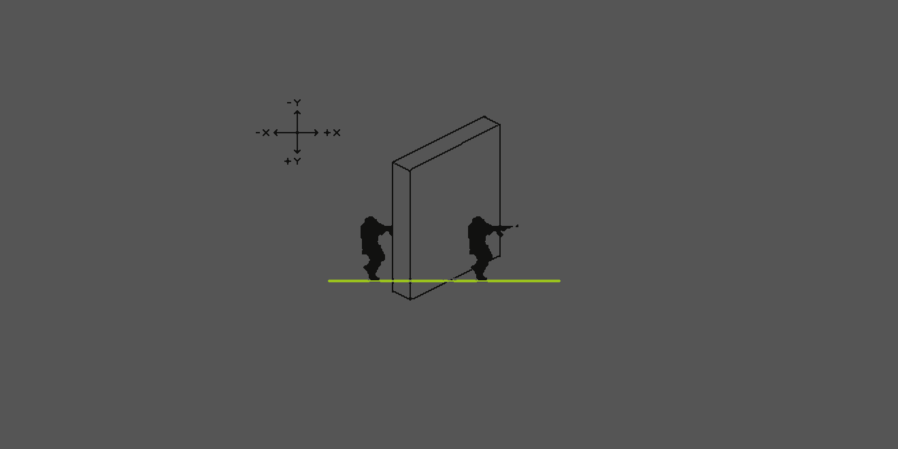

### Solution „Isometric Coordinates“
The fundamental question is: why is the soldier on the left behind the object and the soldier on the right in front of the wall, when their Y value, and thus Z order, are the same? Further: if we flip the wall, what would change in the player characters’ Z order, so that now the left one would be in front?

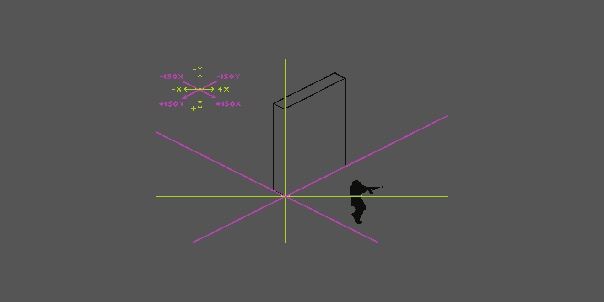

When we talked about coordinates so far, we meant a Cartesian coordinate system (green) with a vertical Y axis and a horizontal X axis. The solution to our problem comes, however, using a second, isometric coordinate system (pink) in combination with the Cartesian one.
For simplicity’s sake, let us assume that the origin point of the wall element is on the Cartesian coordinates 0,0. In that spot, Cartesian and isometric coordinates are identical.
```
cartX = isoX = 0
cartY = isoY = 0
```
Every other point on our Cartesian coordinate system can be transposed to a value in the isometric coordinate system.
The formula for achieving this in our pixel-optimised isometric world is:
```
isoX = (x - y) * (tileWidth / 2)
isoY = (x + y) * (tileHeight / 2)
```
Our tile specifications are only relevant in so much as the tiles are half as high as they are wide. Thus, we can simplify to:
```
isoX = (x - y)
isoY = (x + y) /2
```
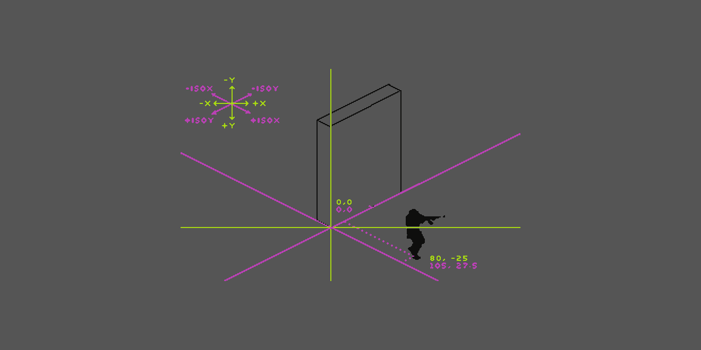

The player character has Cartesian coordinates of 80, -25 and isometric coordinates of 105, 27.5. As our world has a Y axis with negative up, the value is actually 105, -27.5.
From referring to our objects’ isometric and Cartesian coordinates, we can draw the following inferences:

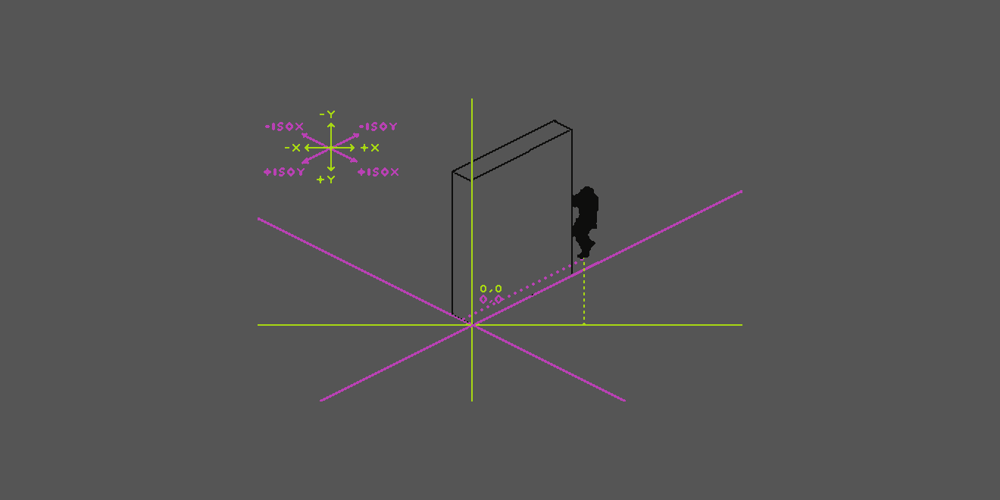

Coming from the right, the player should be displayed in front of the object as long as he does not overstep the isometric Y axis (as our object’s origin point is conveniently located at 0,0).
If the player approaches from left or right, it can be determined via the player’s Cartesian X coordinate.
```
If PlayerX > ObjectX and PlayerIsoX > ObjectIsoX, then set PlayerZ = ObjectZ+1
```
Coming from the left, the player should be displayed in front as long as he does not overstep the isometric X axis.
```
If PlayerX < ObjectX and PlayerIsoY > ObjectIsoY, then set PlayerZ = ObjectZ+1
```
In all other cases, when the player is in no collision with objects, the usual Y sorting applies. Syncing Z order directly to the isometric Y values is not possible, because it does not account for the different approaches from left and right. Cases need to be separated to determine which value, iso Y or iso X, determines Z order.
We set this up successfully in code. The player sprite is “carrying around” a collision mask that only is detecting object collisions (blue in the image below). A collision then triggers the value comparisons and Y sorting.
This could be the end of the story. But there is more.

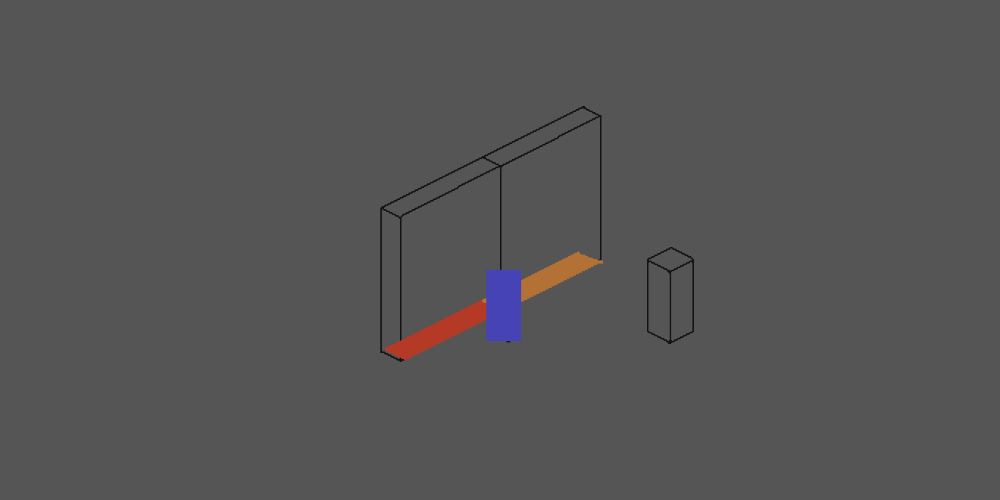

When the player was in collision with multiple environmental objects, it could happen that it would be sorted already behind an object it should still be in front of. In the image above the blue trigger of the player is in collision with the collision of both wall elements and adopts the Z order from the right one, and is thus sorted behind the other wall element.
To prevent this the function is taking the highest Z order of the elements the player is touching.
It occurred to us then, that a simple collision detection between the player and environmental objects and setting the player’s Z order to +1 of the object he collides with is simply enough!

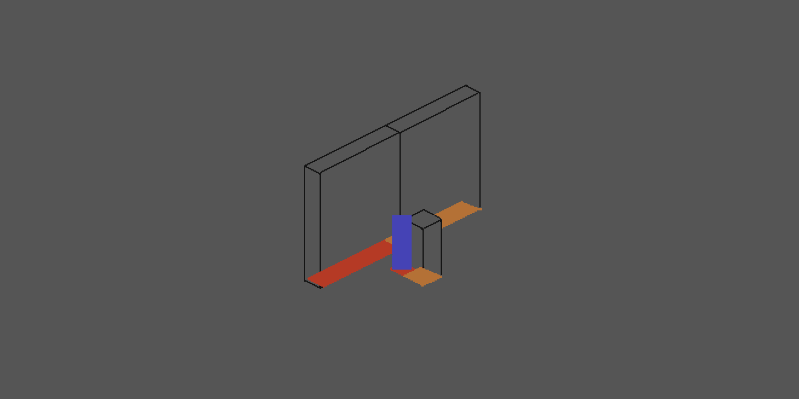

Cases where the player would collide with objects that are in front of them, as the lower column in the image are prevented by the fact, that the blue sorting feeler can never touch objects that are in a Cartesian sense lower than the player. Blue cannot touch the orange of the column in this case.
This way we were able to string this whole problem into one single short function in our code.

We nevertheless hope this is of some value to you.
